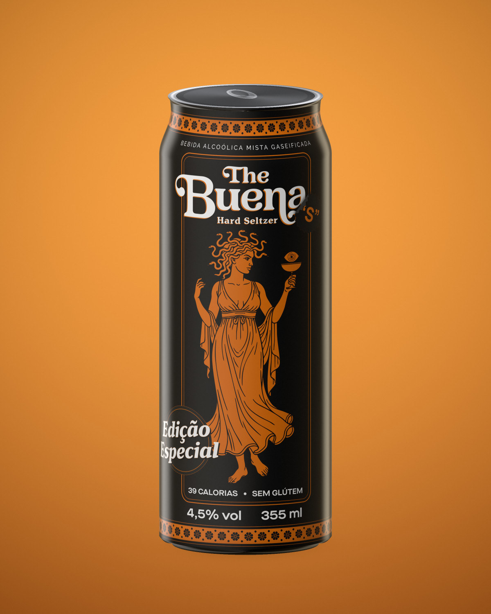

# The Buena Hard Seltzer — como subir no `eria_portifas`

Pacote pronto pra arrastar na raiz do repositório. Nada de build, nada de dependência nova.

---

## 1. Onde cada arquivo vai

```
eria_portifas/
├── the-buena.html                     ← NOVO  (estudo de caso)
├── the-buena-3d.html                  ← NOVO  (lata 3D, versão corrigida)
├── projects.html                      ← EDITAR (cola o card do passo 3)
└── assets/
    ├── images/
    │   └── the-buena/                 ← NOVO  (pasta inteira)
    │       ├── the-buena-01-hero.jpg
    │       ├── the-buena-02-trio.jpg
    │       ├── the-buena-03-detalhe.jpg
    │       ├── the-buena-04-social.jpg
    │       ├── the-buena-05-vistas.jpg
    │       ├── the-buena-rotulo-plano.png
    │       ├── the-buena-rotulo-3d.jpg
    │       ├── the-buena-card.jpg
    │       ├── the-buena-og.jpg
    │       └── the-buena-360-poster.jpg
    └── video/
        └── the-buena-360.mp4          ← NOVO
```

Estrutura de pastas idêntica à que o `project-template.html` já usa (`assets/css`, `assets/js`, `assets/images`).

---

## 2. Subindo

**Pela interface do GitHub:** abra o repositório → **Add file → Upload files** → arraste as pastas
e os dois `.html` → commit em `main`. O GitHub cria os diretórios sozinho.

**Pelo terminal:**

```bash
git clone https://github.com/eu-eria/eria_portifas.git
cd eria_portifas
# copie o conteúdo do pacote aqui dentro, preservando as pastas
git add the-buena.html the-buena-3d.html assets/images/the-buena assets/video
git commit -m "Adiciona case The Buena Hard Seltzer"
git push
```

O `.mp4` tem 1,9 MB — bem abaixo do limite de 100 MB por arquivo do GitHub, não precisa de LFS.

---

## 3. Card na grade de projetos

Em `projects.html`, dentro de `<section class="bento">`, cole o bloco abaixo. Ele já usa
`data-category="embalagem"`, então o filtro **Embalagem** pega automático.

```html
<a href="the-buena.html" class="project-card b-2x1" data-category="embalagem">
  <span class="card-index">08</span>
  
  <span class="card-reveal">Ver projeto <span class="arrow">→</span></span>
  <div class="project-info"><span class="project-title">The Buena</span><span class="project-category">Embalagem</span></div>
</a>
```

Se quiser o card em destaque grande, troque `b-2x1` por `b-2x2`. Sem classe nenhuma ele
vira card padrão. O `card-index` (`08`) é só o numerozinho no canto — ajuste conforme a ordem.

---

## 4. Coisa importante que achei no repositório

`contact.html` aponta pra `css/style.css` e `js/main.js`, mas as outras páginas apontam
pra `assets/css/…` e `assets/js/…`. Hoje só existe `assets/css/` — ou seja:

- `assets/js/main.js`, `ripple.js`, `animations.js` e `navigation.js` retornam **404**;
- os `<script>` do `index.html`, `projects.html` e `project-template.html` estão quebrados
  (o site aparece estilizado, mas sem alternador de tema, filtros e scroll suave);
- o `contact.html` está sem CSS nenhum.

O `the-buena.html` segue o mesmo padrão do `project-template.html` (`assets/…`), então
quando você subir os JS na pasta certa ele passa a funcionar junto, sem edição.
Se preferir resolver agora: suba os `.js` em `assets/js/` e troque os caminhos do
`contact.html` de `css/` e `js/` para `assets/css/` e `assets/js/`.

---

## 5. Ajustes rápidos

| O que | Onde |
|---|---|
| Textos do case | `the-buena.html`, blocos marcados com `<!-- TROQUE: -->` |
| Ficha (produto, escopo, ano) | `the-buena.html`, `<section class="project-meta">` |
| Ordem/tamanho das imagens | `the-buena.html`, blocos `<figure class="tb-figure">` |
| Cores dos swatches | `the-buena.html`, `.tb-swatches` |
| Vídeo com controles | tire `autoplay` e ponha `controls` na tag `<video>` |
| Fundo da lata 3D | `the-buena-3d.html?bg=%230b0b0c` ou `?bg=transparent` |
| Lata 3D sem interface | `the-buena-3d.html?ui=0` |
| Lata 3D parada | `the-buena-3d.html?rotate=0` |

---

## 6. O que mudou nos mockups

Os arquivos antigos foram gerados a partir de uma textura de **796 × 663 px** embutida em
base64 no `lata-3d-interativa.html`. Esta versão parte do PDF vetorial rasterizado a
**300 dpi (9961 × 8242 px)** — daí a diferença de nitidez na tipografia miúda.

Também foram corrigidos:

- **Proporção da lata.** O estreitamento do ombro estava em ~23%; numa lata sleek 355 ml
  real é ~13%. O perfil agora usa Ø 58,6 mm e 156 mm de altura.
- **Posição dos painéis.** Cada vista é girada no ângulo medido na arte: frente em
  `u = 0,5065`, verso em `0,131`, lateral em `0,877`. Antes as vistas cortavam os painéis
  no meio.
- **Tampa.** Recravo, parede rebaixada, painel e lingueta em vez de um disco cinza chapado.
- **Iluminação.** Reflexo de ambiente calculado no azimute 2θ, com duas softboxes laterais —
  é o que devolve o preto ao preto e faz o brilho correr pela lata quando ela gira.

O `the-buena-3d.html` é o seu `lata-3d-interativa.html` com três mudanças: textura externa
em 2048 × 2048 (em vez do base64), proporção da arte corrigida e mipmaps ligados. O arquivo
caiu de 93 KB para 18 KB.
